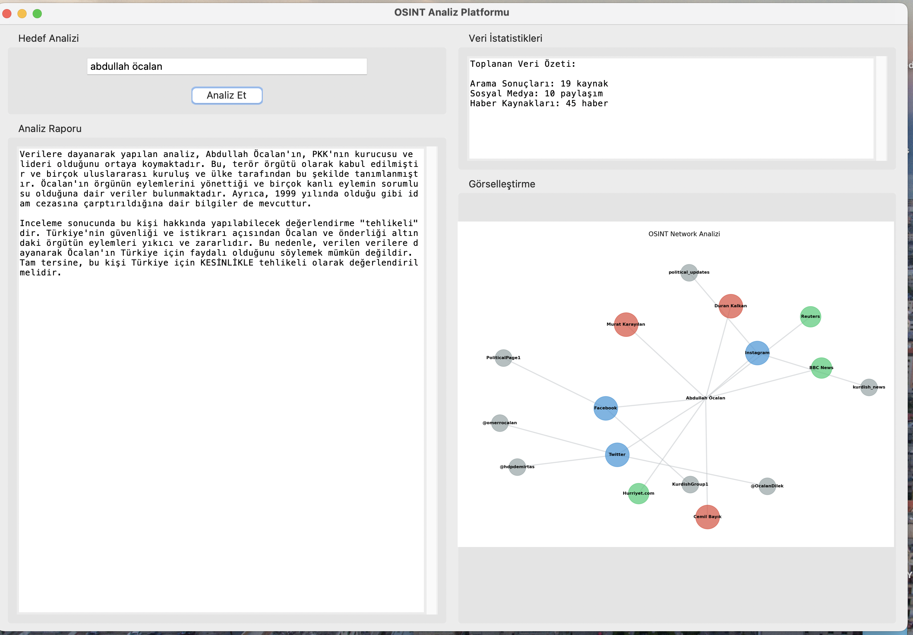

# LLM ile OSINT Yazılımı Tasarımı

Bu proje, **Büyük Dil Modelleri (LLM)** kullanarak OSINT verilerini toplama, analiz etme ve görselleştirme çözümleri sunar.

## Özellikler
- **Veri Toplama**
  - Arama motorlarından, sosyal medya platformlarından ve haber kaynaklarından veri çekme.
- **Analiz**
  - GPT-4 ile bağlamsal analiz ve tehdit değerlendirmesi.
- **Görselleştirme**
  - İlişki haritalama ve dinamik arayüz.

## Kullanım Alanları
1. Güvenlik analizi
2. Akademik araştırmalar
3. Dijital iz takip analizi

## Teknolojiler
- **Python 3.12**
- **OpenAI API**
- **NetworkX**
- **BeautifulSoup**

## Gelecek Geliştirmeler
- Maltego eklentileri.
- Yeni veri kaynakları.

## Örnek Vaka: Güvenlik Analizi

Aşağıdaki görsel, bir hedefin sosyal medya ve haber bağlantılarını analiz ederek oluşturulan ilişki haritasını göstermektedir:

Bu görsel, NetworkX ve GPT-4 kullanılarak üretilmiştir.

